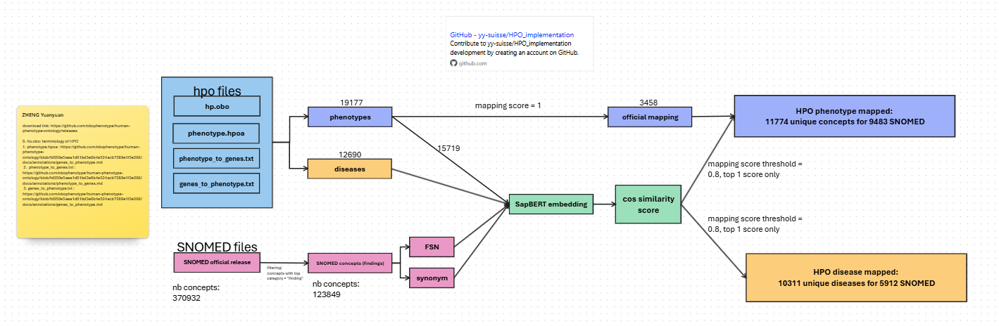

# HPO to SNOMED Mapping Pipeline

This project implements a pipeline to translate disease–phenotype associations into disease–SNOMED CT concept associations. It integrates:

✅ Official cross-references from HPO to SNOMED CT  
✅ Semantic mappings using SapBERT embeddings for HPO terms without direct SNOMED mappings  

The result is a rich mapping between diseases, phenotypes, and SNOMED concepts for downstream analyses such as knowledge graph building, data integration, and clinical analytics.


---
## 🔬 Use Cases
- Integrate HPO's phenotypes and diseases into SNOMED using SapBERT embedding semantic search

## 📂 Pipeline Steps

### 1. Load Data

- Load the HPO ontology (`hp.obo`) as a graph
- Load HPO association files:
  - `phenotype.hpoa` — disease–phenotype associations
  - `phenotype_to_genes.txt` — phenotype → gene → disease mappings
  - `genes_to_phenotype.txt` — disease → gene → phenotype mappings
- Load SNOMED CT data:
  - SNOMED concepts and terms
  - SNOMED semantic tags, e.g. top categories such as “finding”

---

### 2. Process HPO Concepts

- Extract HPO concepts from the ontology:
  - IDs, labels, definitions, synonyms, xrefs
- Split concepts into:
  - **Mappable:** concepts with official SNOMED xrefs
  - **Non-mappable:** concepts without SNOMED xrefs

---

### 3. Official Mappings

- For mappable HPO concepts:
  - Extract SNOMED IDs from xrefs
  - Join with SNOMED concept terms for official mappings

---

### 4. Semantic Mappings (SapBERT)

- For non-mappable HPO concepts:
  - Encode HPO labels/synonyms with SapBERT
  - Encode SNOMED terms with SapBERT
  - Compute cosine similarity
  - Keep mappings above a similarity threshold

---

### 5. Disease Name Mapping

- Map disease names from `phenotype.hpoa` to SNOMED CT using SapBERT embeddings

---

### 6. Create Association Mappings

- Combine official and semantic mappings into a unified HPO → SNOMED mapping table
- Build gene–phenotype–disease associations:
  - Map phenotype → gene connections onto SNOMED
  - Map gene → phenotype connections onto SNOMED

---

### 7. Save Outputs

Outputs are saved as Parquet files in the `output_mapping/` folder:

1. HPO diseases and phenotype mappings:  
   - `all_pheno_hpo_snomed_mapping.parquet` — full mapping of HPO phenotype → SNOMED concepts
   - `all_disease_hpo_snomed_mapping.parquet` — full mapping of HPO disease → SNOMED concepts

2. disease gene phenotype association, where disease and phenotype are mapped to SNOMED, only the maping with top 1 score >= 0.8 are kept:
   - `pheno_to_gene_snomed_mapping.parquet` — phenotype, gene and diseases associations in SNOMED space
   - `gene_to_pheno_snomed_mapping.parquet` —  phenotype, gene and diseases associations in SNOMED space
---

## 💾 Input Files

| File | Description |
|------|-------------|
| `docs/hp.obo` | HPO ontology in OBO format |
| `docs/phenotype.hpoa` | Disease–phenotype associations |
| `docs/phenotype_to_genes.txt` | Phenotype → gene mappings |
| `docs/genes_to_phenotype.txt` | Gene → phenotype mappings |
| `snomed/released_version.parquet` | SNOMED CT terms |
| `snomed/concept_snomed_hug.parquet` | SNOMED concepts with semantic tags |

SapBERT Model:

- [cambridgeltl/SapBERT-from-PubMedBERT-fulltext](https://huggingface.co/cambridgeltl/SapBERT-from-PubMedBERT-fulltext)

---

## ⚙️ Configuration

Configuration is defined in the `Config` dataclass:

```python
Config(
    hpo_files_path="docs/",
    snomed_file_path="snomed/",
    embedding_model_hf="cambridgeltl/SapBERT-from-PubMedBERT-fulltext",
    output_embedding_folder="embeddings_sapbert_and_info/",
    output_mapping_folder="output_mapping/",
    mapping_threshold=0.8,
    batch_size=1000
)

